# School_District_Analysis

## Overview of Project
Prepare all district standardized test data for analysis, reporting and presentation to provide insights about performance trends and patterns. 

The district school board has determined that there was evidence of academic dishonesty and that the Thomas High School (THS) grades were altered. For this reason we will be replacing the grade data for THS 9th graders with "Nans". 

## Results 
How does replacing the 9t grade scores impact the following: 
1.  #### Disctrict level summary:
Replacing the 9th grade THS test data with "Nans" caused slight deterioration in overall math testing scores/pass rates as well as reading pass rates, there was however a slight increase in reading scores (see images below). Note that there was minimal overall impact as only 1.2% of the total district scores were from THS 9th graders. 
  - Original  
   
  - THS 9th grade test scores replaced    
   
2.  #### School level summary and Thomas High School’s performance relative to the other schools: 
THS was the 2nd best "% Overall Passing" rate both before and after the replacement of the 9th grade score data. Only Cabrera High School's overall performance was higher. Again, it is interesting to note that although THS's overall pass rates went down after replacing the 9th grade data, the average score actually increased. (See images below)
  - Original
  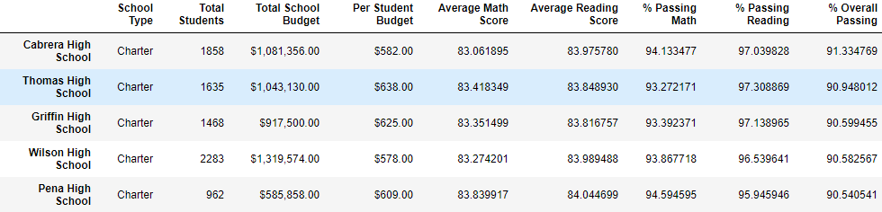 
  - THS 9th grade test scores replaced    
  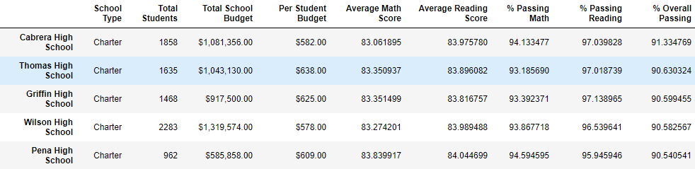 
3.  #### Math and reading scores by grade 
All 9th grade scores have been removed from the grade level analysis - no other changes. 
  - Math scores by grade 
     Original  
     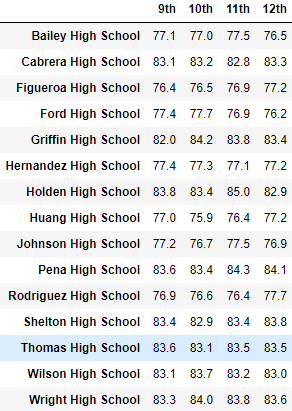  
     THS 9th grade test scores replaced 
     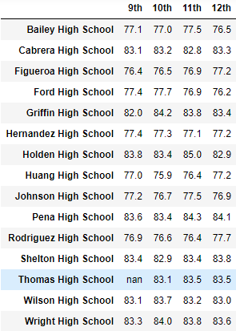    
  - Reading scores by grade  
     Original  
     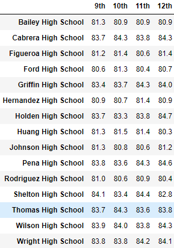 
     THS 9th grade test scores replaced 
     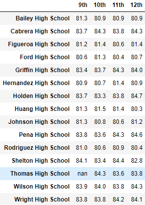 
4.  #### Scores by school spending 
We see no changes between the original and removed data summary whithout going to a further decimale place. (see images below)
  - Original  
  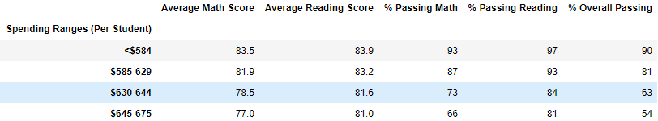 
  - THS 9th grade test scores replaced 
  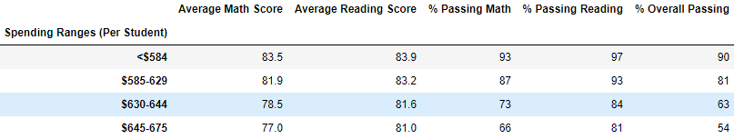 
5.  #### Scores by school size 
We see no changes between the original and removed data summary whithout going to a further decimale place. (see images below)
  - Original  
  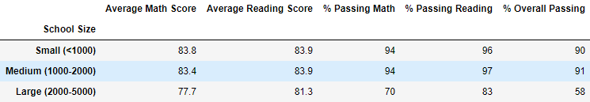 
  - THS 9th grade test scores replaced 
  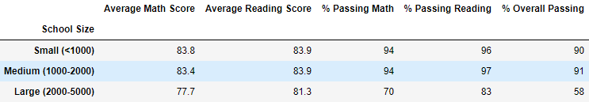 
6.  #### Scores by school type 
We see no changes between the original and removed data summary whithout going to a further decimale place. (see images below)
  - Original  
  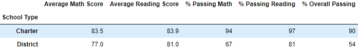 
  - THS 9th grade test scores replaced 
  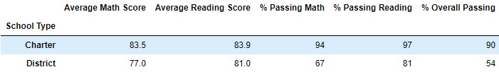 

## Summary
4 changes after replacing the reading and math changes. 
1. There was only a slight deterioration in overall math testing scores/pass rates as well as reading pass rates(district level summary)
2. There was a slight increase in reading scores (district level summary)
3. Thomas high scool was one of the top performing schools regardless of the data replacement (2nd overall pass rates)
4. Charter schools make up the top 5 performing schools and district schools make up the bottom 5 - there is no impact to that statement with our without the replaced data. 
