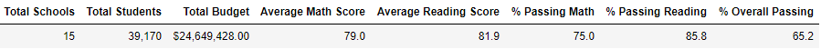
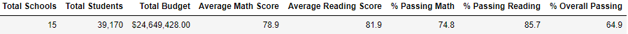

# School_District_Analysis

## Overview of Project
Prepare all district standardized test data for analysis, reporting and presentation to provide insights about performance trends and patterns. 

The district school board has determined that there was evidence of academic dishonesty and that the Thomas High School (THS) grades were altered. For this reason we will be replacing the grade data for THS 9th graders with "Nans". 

## Results 
How does replacing the 9t grade scores impact the following: 
- Disctrict level summary:
Replacing the 9th grade THS test data with "Nans" caused slight downward movement in all testing metrics at the district level (see images below). Note that there was minimal overall impact as only 1.2% of the total district scores were from THS 9th graders. 
  - Original  
   
  - THS 9th grade test scores replaced    
   
- School level summary
- Thomas High School’s performance relative to the other schools
- Math and reading scores by grade
- Scores by school spending
- Scores by school size
- Scores by school type
